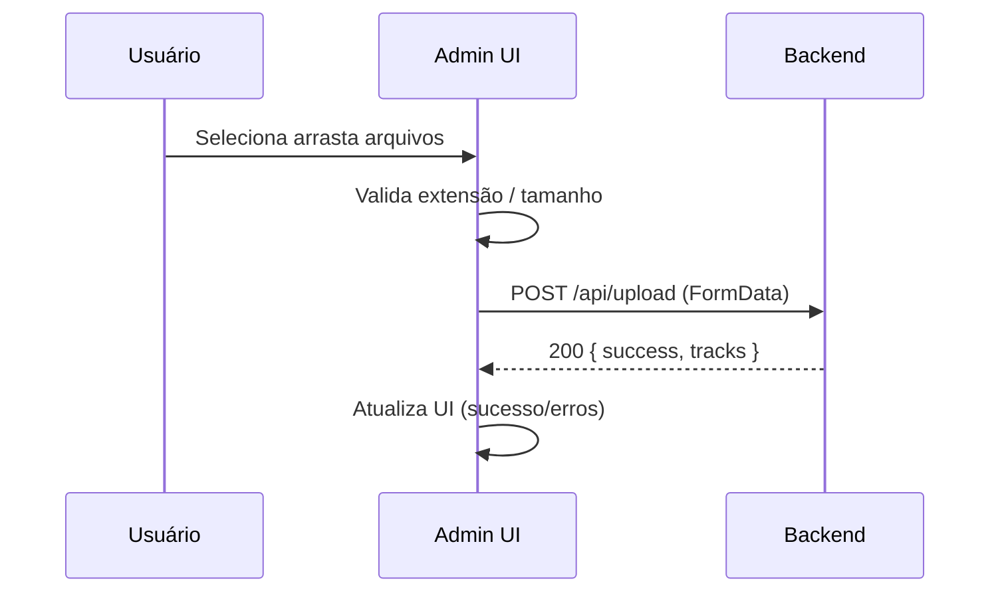

# 🔧 Guia Técnico - Radio Importante PWA

> **Complemento**: PLANO_EXECUCAO.md  
> **Foco**: Detalhes técnicos, troubleshooting e manutenção  
> **Atualizado em**: 16/09/2025 21:15 UTC  
> **Para**: Programador Junior/Amador

---

## 🆕 Atualizações Recentes (16/09/2025)

### ✅ CloudFront + Deploy Pipeline
```bash
PROBLEMA: AccessDenied ao criar invalidations
CAUSA: IAM Policy com Resource amarrado ao ARN específico
SOLUÇÃO: Alterado para "Resource": "*"
RESULTADO: Invalidation funcionando em ~2-3 min por deploy
```

### ✅ Vite Build / Admin Panel
```bash
PROBLEMA: admin.html antigo (2.195 bytes) servindo versão quebrada
CAUSA: Vite não configurado para múltiplos entrypoints
SOLUÇÃO: rollupOptions.input adicionou admin.html + novo src/admin.ts
RESULTADO: Admin funcional (upload, health check, tabs, drag & drop)
```

---

## 🛠️ **DETALHES TÉCNICOS DA MIGRAÇÃO**

### **Como o Sistema Funciona Agora (Explicação Simples)**

#### **1. Fluxo de Upload Completo**
```bash
PASSO 1: User faz upload pelo frontend
↓
PASSO 2: Frontend envia POST para /api/upload
↓  
PASSO 3: Flexible middleware aceita 'audioFiles' ou 'file'
↓
PASSO 4: Multer salva arquivo em UPLOAD_PATH (/app/public/audio)
↓
PASSO 5: Sistema cria entrada no catálogo
↓
PASSO 6: saveCatalog() salva em CATALOG_PATH (/app/public/data/catalog.json)
↓
PASSO 7: Response com sucesso + dados do track
```

#### **2. Fluxo de Serving de Arquivos**
```bash
PASSO 1: Frontend/User requisita /audio/filename.mp3
↓
PASSO 2: Express middleware express.static procura arquivo
↓
PASSO 3: Arquivo encontrado em audioPath (/app/public/audio)
↓
PASSO 4: Express serve arquivo com headers corretos
↓
PASSO 5: Browser recebe arquivo e pode reproduzir
```

#### **3. Environment Variables (CRÍTICAS)**
```javascript
// Como funciona no código:
const audioPath = process.env.UPLOAD_PATH || path.join(process.cwd(), 'public', 'audio');

// Se UPLOAD_PATH está definido no DigitalOcean → usa ele
// Se não está definido → usa caminho local (desenvolvimento)

// Valores em produção (DigitalOcean):
UPLOAD_PATH="/app/public/audio"           // Onde salva uploads
CATALOG_PATH="/app/public/data/catalog.json"  // Onde salva catálogo
PORT="8080"                               // Porta do servidor
NODE_ENV="production"                     // Ambiente
FRONTEND_URL="https://radio.importantestudio.com"  // Para CORS
```

### **Docker Container (Como Funciona)**

#### **Dockerfile Explicado Linha por Linha**
```dockerfile
FROM node:18-alpine
# Pega imagem base com Node.js 18 (versão LTS)
# Alpine = versão Linux pequena e rápida

WORKDIR /app  
# Define /app como diretório de trabalho dentro do container
# Todos os comandos seguintes executam de /app

COPY package*.json ./
# Copia package.json e package-lock.json primeiro
# Por que primeiro? Para cache do Docker - se dependências não mudaram, não reinstala

RUN npm ci
# Instala dependências
# npm ci é mais rápido que npm install para produção

COPY . .
# Copia resto do código para o container
# Feito depois para aproveitar cache das dependências

EXPOSE 8080
# Informa que a aplicação usa porta 8080
# Não abre a porta, só documenta

CMD ["node", "app.js"]
# Comando para iniciar a aplicação quando container roda
```

#### **Como Build e Deploy Funcionam**
```bash
TRIGGER: git push origin main

PROCESSO NO DIGITALOCEAN:
1. DigitalOcean detecta push (GitHub webhook)
2. Clona repositório na branch main  
3. Navega para /backend (source_dir configurado)
4. Executa: docker build -f Dockerfile .
5. Docker executa cada linha do Dockerfile
6. Imagem criada e armazenada no registry DigitalOcean
7. Container antigo é parado
8. Novo container é iniciado com nova imagem
9. Health check verifica se está funcionando
10. Tráfego é direcionado para novo container
11. Container antigo é removido

TEMPO TOTAL: ~2-3 minutos
```

---

## 🚨 **TROUBLESHOOTING E PROBLEMAS COMUNS**

### **Problema: Upload funciona mas arquivo retorna 404**

#### **Diagnóstico**
```bash
SINTOMA: POST /api/upload → 200 OK, mas GET /audio/filename → 404

CAUSAS POSSÍVEIS:
1. Multiple instances (arquivo salvo em instância A, request em B)
2. Static middleware não configurado
3. Environment variable UPLOAD_PATH incorreta
4. Permissions no filesystem

COMO INVESTIGAR:
curl -I https://radio-importante-pwa-backend-skg2w.ondigitalocean.app/audio/filename
- Se 404 → problema de serving
- Se 200 → problema resolvido
```

#### **Soluções**
```bash
SOLUÇÃO 1: Verificar instance_count
doctl apps spec get f8c358ee-ba7e-4da4-8ffe-065f9554a061 | grep instance_count
- Se > 1 → reduzir para 1 ou implementar storage externo

SOLUÇÃO 2: Verificar static middleware
grep -n "express.static" backend/app.js
- Deve ter: app.use('/audio', express.static(audioPath))

SOLUÇÃO 3: Verificar environment variables
DigitalOcean Dashboard → Settings → Environment Variables
- UPLOAD_PATH deve estar definido
```

### **Problema: Environment variables não estão funcionando**

#### **Diagnóstico**
```bash
SINTOMA: Código usa paths locais em vez de environment variables

COMO VERIFICAR:
1. DigitalOcean Dashboard → Settings → Environment Variables
2. Verificar se UPLOAD_PATH e CATALOG_PATH estão definidos
3. Verificar logs de startup: "Upload path: /app/public/audio"

LOGS DE STARTUP SAUDÁVEIS:
🎵 Radio Importante Backend v2.2.4 running on port 8080
📊 Environment: production  
🔗 Health check: http://localhost:8080/health
📁 Catalog tracks: 0
📁 Upload path: /app/public/audio  ← DEVE MOSTRAR ESTE PATH
```

#### **Soluções**
```bash
SOLUÇÃO 1: Verificar variáveis no DigitalOcean
- Ir em Settings → Environment Variables
- Confirmar que UPLOAD_PATH=/app/public/audio está presente
- Se não estiver → adicionar e redeploy

SOLUÇÃO 2: Verificar código
grep -n "process.env.UPLOAD_PATH" backend/app.js
- Deve aparecer nas linhas do multer e express.static

SOLUÇÃO 3: Forçar redeploy
doctl apps create-deployment f8c358ee-ba7e-4da4-8ffe-065f9554a061
```

### **Problema: MulterError: Unexpected field**

#### **Diagnóstico**
```bash
SINTOMA: Upload retorna erro "Unexpected field"

CAUSA: Frontend enviando campo diferente do esperado
- Frontend envia: 'file'
- Backend espera: 'audioFiles'
- Ou vice-versa

COMO VERIFICAR:
- Olhar error message: qual field foi enviado vs esperado
- Verificar flexible middleware está ativo
```

#### **Soluções**
```bash
SOLUÇÃO 1: Verificar flexible middleware
grep -A 20 "flexibleUpload" backend/app.js
- Deve ter lógica para tentar 'audioFiles' depois 'file'

SOLUÇÃO 2: Testar manualmente
curl -X POST -F "audioFiles=@test.mp3" /api/upload  # Tenta audioFiles
curl -X POST -F "file=@test.mp3" /api/upload        # Tenta file

SOLUÇÃO 3: Frontend
- Verificar FormData no frontend usa nome correto
- Preferred: 'audioFiles' (plural)
```

### **Problema: Deploy falha ou app não inicia**

#### **Diagnóstico**
```bash
ONDE VERIFICAR:
DigitalOcean Dashboard → Runtime Logs

ERROS COMUNS:
1. "npm ci failed" → problema com package.json
2. "Port 8080 already in use" → configuração de porta
3. "Cannot find module" → dependência faltando
4. "EACCES permission denied" → problema de filesystem
```

#### **Soluções**
```bash
ERRO: npm ci failed
CAUSA: package-lock.json inconsistente
SOLUÇÃO: 
- Deletar node_modules e package-lock.json local
- npm install localmente
- Commit package-lock.json atualizado

ERRO: Port already in use  
CAUSA: Environment variable PORT incorreta
SOLUÇÃO: Verificar PORT=8080 nas environment variables

ERRO: Cannot find module
CAUSA: Dependência não listada em package.json
SOLUÇÃO: npm install --save nome-da-dependencia

ERRO: Permission denied
CAUSA: Container tentando escrever em local não permitido
SOLUÇÃO: Verificar UPLOAD_PATH e CATALOG_PATH paths
```

---

## 🔍 **COMANDOS ÚTEIS PARA MANUTENÇÃO**

### **DigitalOcean CLI (doctl)**

#### **Comandos Básicos**
```bash
# Listar apps
doctl apps list

# Ver detalhes do app
doctl apps get f8c358ee-ba7e-4da4-8ffe-065f9554a061

# Ver spec atual
doctl apps spec get f8c358ee-ba7e-4da4-8ffe-065f9554a061

# Forçar novo deploy
doctl apps create-deployment f8c358ee-ba7e-4da4-8ffe-065f9554a061

# Ver logs (se disponível via CLI)
doctl apps logs f8c358ee-ba7e-4da4-8ffe-065f9554a061
```

#### **Comandos de Configuração**
```bash
# Atualizar app com novo spec
doctl apps update f8c358ee-ba7e-4da4-8ffe-065f9554a061 --spec app-spec.yaml

# Ver deployments
doctl apps list-deployments f8c358ee-ba7e-4da4-8ffe-065f9554a061
```

### **Teste e Debug**

#### **Health Checks**
```bash
# Health check básico
curl https://radio-importante-pwa-backend-skg2w.ondigitalocean.app/health

# Health check com detalhes
curl -v https://radio-importante-pwa-backend-skg2w.ondigitalocean.app/health

# Teste de CORS
curl -H "Origin: https://radio.importantestudio.com" \
     -H "Access-Control-Request-Method: POST" \
     -H "Access-Control-Request-Headers: Content-Type" \
     -X OPTIONS \
     https://radio-importante-pwa-backend-skg2w.ondigitalocean.app/api/upload
```

#### **Teste de Upload**
```bash
# Upload com audioFiles (preferido)
curl -X POST \
     -F "audioFiles=@devFiles/MrakReserva.mp4" \
     https://radio-importante-pwa-backend-skg2w.ondigitalocean.app/api/upload

# Upload com file (fallback)
curl -X POST \
     -F "file=@devFiles/MrakReserva.mp4" \
     https://radio-importante-pwa-backend-skg2w.ondigitalocean.app/api/upload

# Verificar se arquivo está acessível
curl -I https://radio-importante-pwa-backend-skg2w.ondigitalocean.app/audio/MrakReserva.mp4
```

#### **Teste de APIs**
```bash
# Catálogo
curl https://radio-importante-pwa-backend-skg2w.ondigitalocean.app/api/catalog

# Catálogo formatado
curl -s https://radio-importante-pwa-backend-skg2w.ondigitalocean.app/api/catalog | jq .

# Root endpoint  
curl https://radio-importante-pwa-backend-skg2w.ondigitalocean.app/
```

### **Docker Local (Para Testes)**

#### **Build e Run Local**
```bash
# Build local
cd backend/
docker build -t radio-backend:local .

# Run local
docker run -p 8080:8080 radio-backend:local

# Run com environment variables
docker run -p 8080:8080 \
           -e UPLOAD_PATH=/app/public/audio \
           -e CATALOG_PATH=/app/public/data/catalog.json \
           radio-backend:local

# Run com volume mount (para persistir arquivos)
docker run -p 8080:8080 \
           -v $(pwd)/public:/app/public \
           radio-backend:local
```

#### **Debug do Container**
```bash
# Ver logs do container
docker logs <container-id>

# Entrar no container  
docker exec -it <container-id> /bin/sh

# Verificar arquivos dentro do container
docker exec <container-id> ls -la /app/public/audio

# Verificar environment variables
docker exec <container-id> env | grep UPLOAD_PATH
```

---

## 🎛️ Admin Panel (Implementação Técnica)
```ts
// src/admin.ts (resumo das responsabilidades)
- Detecta backend disponível (produção ou local)
- Health check automático com feedback visual
- Drag & drop + input file tradicional
- Validação de tipo de arquivo
- Barra de progresso por upload
- Tabs (Upload / Gerenciar) com toggling simples
- Tratamento de erros centralizado
```

### Estrutura de Seletores Importantes
```html
<div id="backend-status-indicator"></div>
<div id="upload-container"></div>
<input id="file-input" type="file" multiple />
<div id="progress-area"></div>
<div id="tabs">
  <button data-tab="upload">Upload</button>
  <button data-tab="manage">Gerenciar</button>
</div>
<div id="tab-upload"></div>
<div id="tab-manage"></div>
```

### Fluxo de Upload no Admin (Frontend → Backend)


### Melhoria Planejada (Gerenciamento de Arquivos)
```bash
FUTURO:
- Listagem de arquivos via /api/catalog
- Botão remover (DELETE /api/file/:id ou filename)
- Preview inline de áudio/vídeo
- Paginação simples (se > 50 arquivos)
```

---

## 🔐 IAM / CloudFront (Referência Rápida)
```json
{
  "Version": "2012-10-17",
  "Statement": [
    {
      "Sid": "CloudFrontInvalidation",
      "Effect": "Allow",
      "Action": [
        "cloudfront:CreateInvalidation",
        "cloudfront:GetInvalidation",
        "cloudfront:ListInvalidations"
      ],
      "Resource": "*"
    }
  ]
}
```

---

## 📌 Notas de Organização
```bash
PLANO_EXECUCAO_ATUALIZADO.md → Depreciado (usar PLANO_EXECUCAO.md)
PLANO_EXECUCAO.md → Fonte única de status + roadmap
GUIA_TECNICO_DETALHADO.md → Este arquivo (how-to + manutenção)
```

---

## 📋 **CHECKLIST DE MANUTENÇÃO**

### **Checklist Semanal**
```bash
□ Verificar uptime via DigitalOcean Dashboard
□ Verificar logs para errors (Runtime Logs)
□ Testar upload manual: curl -X POST -F "audioFiles=@test.mp3" /api/upload
□ Testar file serving: curl -I /audio/test.mp3
□ Verificar response times via health check
□ Backup do catálogo: curl /api/catalog > backup-$(date).json
```

### **Checklist Mensal**
```bash  
□ Verificar usage metrics (CPU, Memory)
□ Review logs para patterns de error
□ Testar disaster recovery (se backup configurado)
□ Update dependencies se necessário: npm audit
□ Verificar storage usage se usando Spaces
□ Review custos DigitalOcean
```

### **Checklist Anual**
```bash
□ Review Node.js version (atualizar Dockerfile se necessário)
□ Review dependências major version updates
□ Avaliar necessidade de scaling (múltiplas instâncias)
□ Avaliar implementação de features futuras
□ Review security practices
□ Backup completo da aplicação
```

---

*📅 Guia técnico revisado em: 16/09/2025 21:15 UTC*  
*📚 Referência principal: PLANO_EXECUCAO.md*
